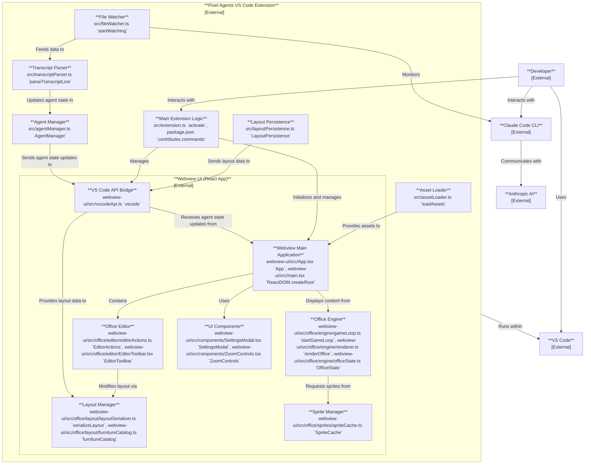

# Unnamed CodeViz Diagram

```mermaid
graph TD

    base.cv::developer["**Developer**<br>[External]"]
    base.cv::vscode["**VS Code**<br>[External]"]
    base.cv::claude_code_cli["**Claude Code CLI**<br>[External]"]
    base.cv::anthropic_ai["**Anthropic AI**<br>[External]"]
    subgraph base.cv::pixel_agents_extension_boundary["**Pixel Agents VS Code Extension**<br>[External]"]
        base.cv::extension_main["**Main Extension Logic**<br>src/extension.ts `activate`, package.json `contributes.commands`"]
        base.cv::file_watcher["**File Watcher**<br>src/fileWatcher.ts `startWatching`"]
        base.cv::transcript_parser["**Transcript Parser**<br>src/transcriptParser.ts `parseTranscriptLine`"]
        base.cv::agent_manager["**Agent Manager**<br>src/agentManager.ts `AgentManager`"]
        base.cv::layout_persistence["**Layout Persistence**<br>src/layoutPersistence.ts `LayoutPersistence`"]
        base.cv::asset_loader["**Asset Loader**<br>src/assetLoader.ts `loadAssets`"]
        subgraph base.cv::webview_ui_container["**Webview UI (React App)**<br>[External]"]
            base.cv::webview_app_main["**Webview Main Application**<br>webview-ui/src/App.tsx `App`, webview-ui/src/main.tsx `ReactDOM.createRoot`"]
            base.cv::vscode_api_bridge["**VS Code API Bridge**<br>webview-ui/src/vscodeApi.ts `vscode`"]
            base.cv::office_engine["**Office Engine**<br>webview-ui/src/office/engine/gameLoop.ts `startGameLoop`, webview-ui/src/office/engine/renderer.ts `renderOffice`, webview-ui/src/office/engine/officeState.ts `OfficeState`"]
            base.cv::office_editor["**Office Editor**<br>webview-ui/src/office/editor/editorActions.ts `EditorActions`, webview-ui/src/office/editor/EditorToolbar.tsx `EditorToolbar`"]
            base.cv::layout_manager["**Layout Manager**<br>webview-ui/src/office/layout/layoutSerializer.ts `serializeLayout`, webview-ui/src/office/layout/furnitureCatalog.ts `furnitureCatalog`"]
            base.cv::sprite_manager["**Sprite Manager**<br>webview-ui/src/office/sprites/spriteCache.ts `SpriteCache`"]
            base.cv::ui_components["**UI Components**<br>webview-ui/src/components/SettingsModal.tsx `SettingsModal`, webview-ui/src/components/ZoomControls.tsx `ZoomControls`"]
            %% Edges at this level (grouped by source)
            base.cv::vscode_api_bridge["**VS Code API Bridge**<br>webview-ui/src/vscodeApi.ts `vscode`"] -->|"Receives agent state updates from"| base.cv::webview_app_main["**Webview Main Application**<br>webview-ui/src/App.tsx `App`, webview-ui/src/main.tsx `ReactDOM.createRoot`"]
            base.cv::vscode_api_bridge["**VS Code API Bridge**<br>webview-ui/src/vscodeApi.ts `vscode`"] -->|"Provides layout data to"| base.cv::layout_manager["**Layout Manager**<br>webview-ui/src/office/layout/layoutSerializer.ts `serializeLayout`, webview-ui/src/office/layout/furnitureCatalog.ts `furnitureCatalog`"]
            base.cv::office_editor["**Office Editor**<br>webview-ui/src/office/editor/editorActions.ts `EditorActions`, webview-ui/src/office/editor/EditorToolbar.tsx `EditorToolbar`"] -->|"Modifies layout via"| base.cv::layout_manager["**Layout Manager**<br>webview-ui/src/office/layout/layoutSerializer.ts `serializeLayout`, webview-ui/src/office/layout/furnitureCatalog.ts `furnitureCatalog`"]
            base.cv::webview_app_main["**Webview Main Application**<br>webview-ui/src/App.tsx `App`, webview-ui/src/main.tsx `ReactDOM.createRoot`"] -->|"Displays content from"| base.cv::office_engine["**Office Engine**<br>webview-ui/src/office/engine/gameLoop.ts `startGameLoop`, webview-ui/src/office/engine/renderer.ts `renderOffice`, webview-ui/src/office/engine/officeState.ts `OfficeState`"]
            base.cv::webview_app_main["**Webview Main Application**<br>webview-ui/src/App.tsx `App`, webview-ui/src/main.tsx `ReactDOM.createRoot`"] -->|"Contains"| base.cv::office_editor["**Office Editor**<br>webview-ui/src/office/editor/editorActions.ts `EditorActions`, webview-ui/src/office/editor/EditorToolbar.tsx `EditorToolbar`"]
            base.cv::webview_app_main["**Webview Main Application**<br>webview-ui/src/App.tsx `App`, webview-ui/src/main.tsx `ReactDOM.createRoot`"] -->|"Uses"| base.cv::ui_components["**UI Components**<br>webview-ui/src/components/SettingsModal.tsx `SettingsModal`, webview-ui/src/components/ZoomControls.tsx `ZoomControls`"]
            base.cv::office_engine["**Office Engine**<br>webview-ui/src/office/engine/gameLoop.ts `startGameLoop`, webview-ui/src/office/engine/renderer.ts `renderOffice`, webview-ui/src/office/engine/officeState.ts `OfficeState`"] -->|"Requests sprites from"| base.cv::sprite_manager["**Sprite Manager**<br>webview-ui/src/office/sprites/spriteCache.ts `SpriteCache`"]
        end
        %% Edges at this level (grouped by source)
        base.cv::file_watcher["**File Watcher**<br>src/fileWatcher.ts `startWatching`"] -->|"Feeds data to"| base.cv::transcript_parser["**Transcript Parser**<br>src/transcriptParser.ts `parseTranscriptLine`"]
        base.cv::transcript_parser["**Transcript Parser**<br>src/transcriptParser.ts `parseTranscriptLine`"] -->|"Updates agent state in"| base.cv::agent_manager["**Agent Manager**<br>src/agentManager.ts `AgentManager`"]
        base.cv::agent_manager["**Agent Manager**<br>src/agentManager.ts `AgentManager`"] -->|"Sends agent state updates to"| base.cv::vscode_api_bridge["**VS Code API Bridge**<br>webview-ui/src/vscodeApi.ts `vscode`"]
        base.cv::extension_main["**Main Extension Logic**<br>src/extension.ts `activate`, package.json `contributes.commands`"] -->|"Manages"| base.cv::vscode_api_bridge["**VS Code API Bridge**<br>webview-ui/src/vscodeApi.ts `vscode`"]
        base.cv::extension_main["**Main Extension Logic**<br>src/extension.ts `activate`, package.json `contributes.commands`"] -->|"Initializes and manages"| base.cv::webview_app_main["**Webview Main Application**<br>webview-ui/src/App.tsx `App`, webview-ui/src/main.tsx `ReactDOM.createRoot`"]
        base.cv::asset_loader["**Asset Loader**<br>src/assetLoader.ts `loadAssets`"] -->|"Provides assets to"| base.cv::webview_app_main["**Webview Main Application**<br>webview-ui/src/App.tsx `App`, webview-ui/src/main.tsx `ReactDOM.createRoot`"]
        base.cv::layout_persistence["**Layout Persistence**<br>src/layoutPersistence.ts `LayoutPersistence`"] -->|"Sends layout data to"| base.cv::vscode_api_bridge["**VS Code API Bridge**<br>webview-ui/src/vscodeApi.ts `vscode`"]
    end
    %% Edges at this level (grouped by source)
    base.cv::developer["**Developer**<br>[External]"] -->|"Uses"| base.cv::vscode["**VS Code**<br>[External]"]
    base.cv::developer["**Developer**<br>[External]"] -->|"Interacts with"| base.cv::extension_main["**Main Extension Logic**<br>src/extension.ts `activate`, package.json `contributes.commands`"]
    base.cv::developer["**Developer**<br>[External]"] -->|"Interacts with"| base.cv::claude_code_cli["**Claude Code CLI**<br>[External]"]
    base.cv::pixel_agents_extension_boundary["**Pixel Agents VS Code Extension**<br>[External]"] -->|"Runs within"| base.cv::vscode["**VS Code**<br>[External]"]
    base.cv::file_watcher["**File Watcher**<br>src/fileWatcher.ts `startWatching`"] -->|"Monitors"| base.cv::claude_code_cli["**Claude Code CLI**<br>[External]"]
    base.cv::claude_code_cli["**Claude Code CLI**<br>[External]"] -->|"Communicates with"| base.cv::anthropic_ai["**Anthropic AI**<br>[External]"]

```
---
*Generated by [CodeViz.ai](https://codeviz.ai) on 2/25/2026, 1:37:34 AM*
